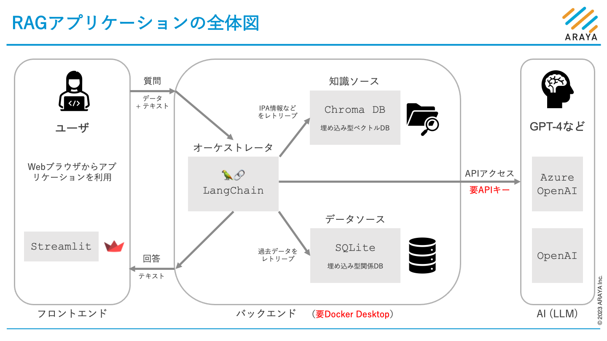
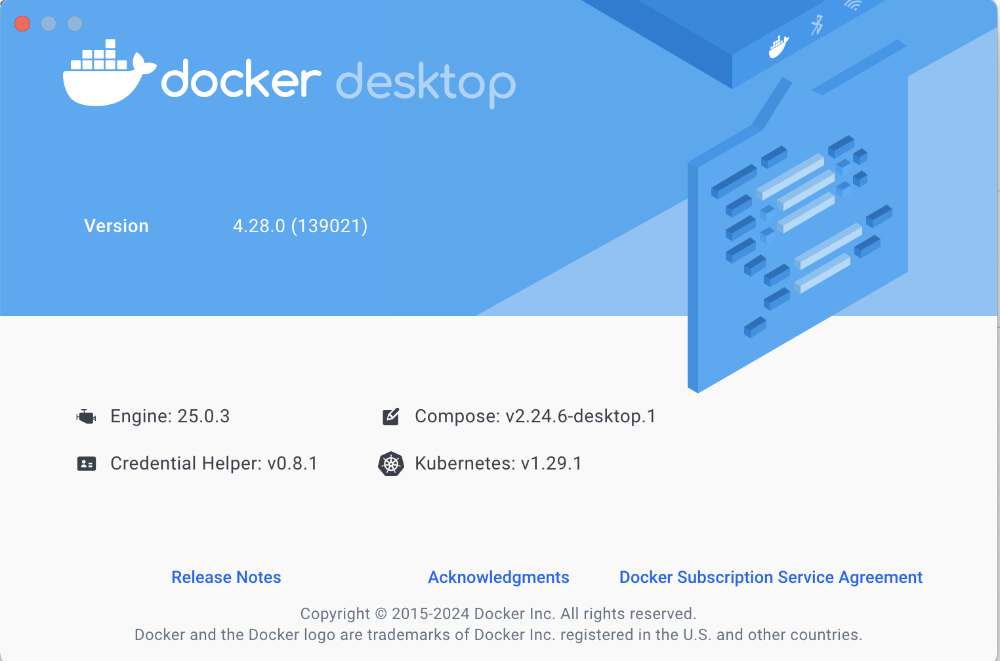
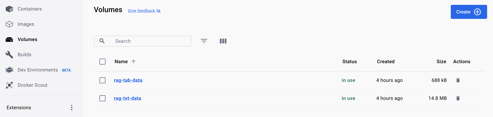

# DockerによるWebアプリのビルドとデプロイ

このドキュメントでは、Dockerを使ってWebアプリケーションのRAGデータベース（SQLデータベースとベクトルデータベース）を構築し、
そのアプリケーションをDockerホスト上にデプロイする方法を説明します。

RAGデータベースの構築には、

1. 既に構築済みのデータベースファイルを利用する方法と、
2. Excelファイルから新たにデータベースを構築する方法があります。

既存のExcelファイル`過去プロジェクト収集データ（サンプル）.xlsx`をそのまま用いる場合、方法1で十分です。
Excelファイルを更新したい場合には方法2を選択します。

## 目次

- [全体図](#全体図)
- [前提条件](#前提条件)
- [RAGデータベースの構築](#ragデータベースの構築)
- [Webアプリケーションのデプロイ](#webアプリケーションのデプロイ)

## 全体図

このアプリケーションの全体図は次の通りです:



また, 上の全体図における各要素とソースコードの対応関係は概ね次の通りです:

| アプリの要素 | ソースコード |
| --- | --- |
| フロントエンド | `app/`, `src/app_util/` |
| オーケストレータ | `src/orchestrator/` |
| 知識ソース | `src/rag_tabular/` |
| データソース |`src/rag_textual/` |
| APIアクセス | `util/api.py` |

## 前提条件

1. Docker Desktop ([https://www.docker.com/products/docker-desktop/](https://www.docker.com/products/docker-desktop/)) がインストールされているとします。

    

1. Linuxコンテナを使用するので、DockerホストのOSがWindowsの場合は、WSL 2 バックエンドが有効化されているとします。参考: Dockerマニュアル ([https://docs.docker.com/desktop/wsl/](https://docs.docker.com/desktop/wsl/))

1. Azure OpenAI関係のセットアップが完了しているとします。具体的には次の条件が満たされているとします:

    - Azure OpenAIのリソースが作成されており、APIキーとエンドポイントが取得できること。
    - そのリソースに`gpt-4`モデルと`text-embedding-3-small`モデルがデプロイされていること。更に、それらのモデル名とデプロイ名が同一であること。

    なお、Microsoft Entra IDによるAzure OpenAI APIの認証方法には現状対応していません。

## RAGデータベースの構築

1. Docker Volumeの作成

    ```bash
    docker volume create rag-tab-data
    docker volume create rag-txt-data
    ```

2. RAGデータベースの構築方法1: 既存のデータベースファイルを利用する

    `docker`ディレクトリに移動し、次のコマンドを実行すると、
    既存のデータベースファイルを上で作成したDockerボリュームにコピーします。

    ```bash
    docker compose -f db-build-1.compose.yaml up
    docker compose -f db-build-1.compose.yaml down
    ```

3. RAGデータベースの構築方法2: データベースを新たに構築する

    まず、新たに使用するExcelファイルを用意し、プロジェクトのルートディレクトリ内に配置します。
    次に、そのExcelファイルのプロジェクトルートから見た相対パスを環境変数`RAG_TAB_PATH`に設定します。
    そのような準備をした上で次のコマンドを実行すると、データベースが新たに構築されます。

    ```bash
    docker compose -f db-build-2.compose.yaml up
    docker compose -f db-build-2.compose.yaml down
    ```

4. RAGデータベースが無事に構築できたことをDocker Desktopで確認

    

## Webアプリケーションのデプロイ

`docker`ディレクトリに移動し、次のコマンドを実行すると、WebアプリがDockerホスト上に立ち上がります。

```bash
docker compose up
```

Dockerホストからは、Webブラウザで`http://localhost:8501`にアクセスすることで、アプリケーションを利用できます。
Dockerホストと同じネットワークにある他の端末からは、DockerホストのIPアドレスを指定してアクセスすることができるはずです。
